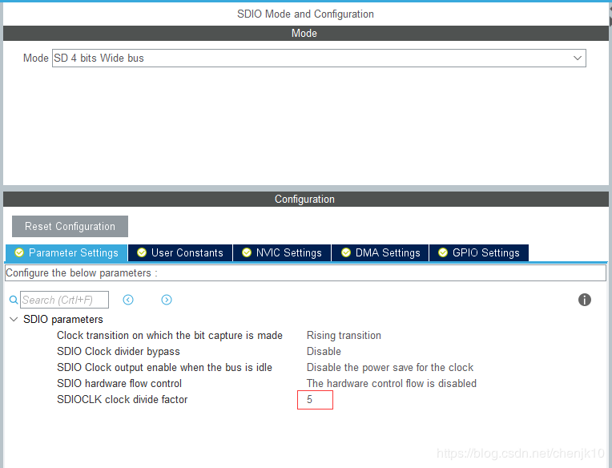
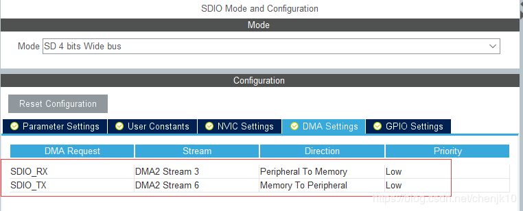
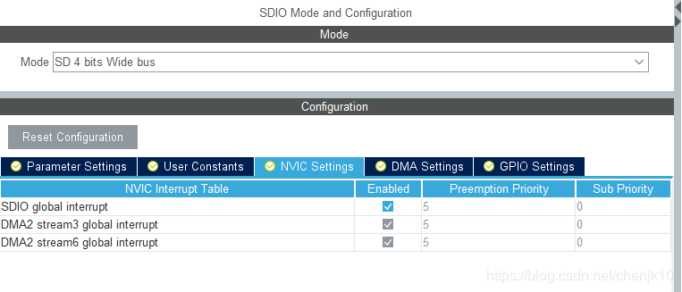
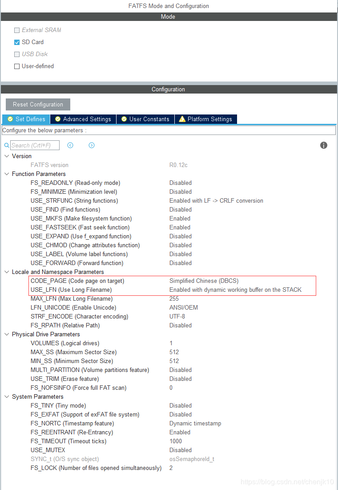
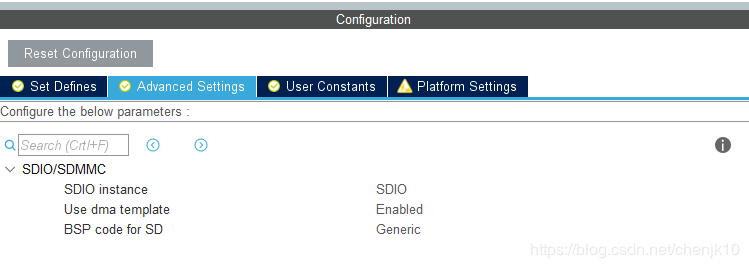
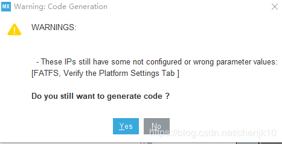
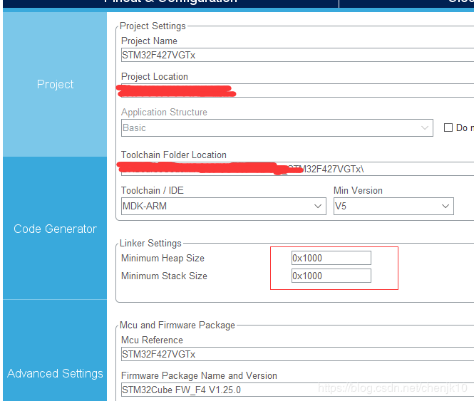
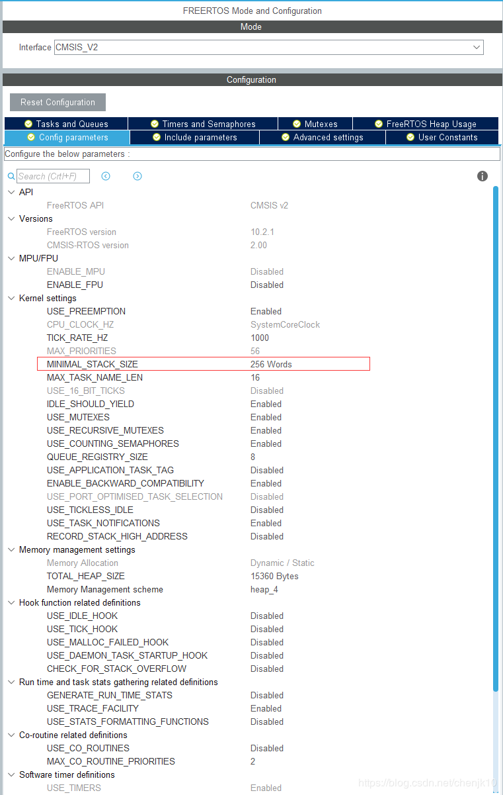

# Stm32CubeMx配置SDIO+FATFS+FREERTOS

芯片型号：STM32F407VET6

软件版本：Stm32CubeMx 5.6.1

库版本：STM32Cube FW_F4 V1.25.0

配置SDIO：
卡时钟（SDIO_CK ）：每个时钟周期在命令和数据线上传输 1 位命令或数据。对于多媒体卡 V3.31 协议，时钟频率可以在 0MHz 至 20MHz 间变化；对于多媒体卡 V4.0/4.2 协议，时钟频率可以在 0MHz 至 48MHz 间变化；对于 SD 或 SD I/O 卡，时钟频率可以在 0MHz 至 25MHz间变化。
SDIO适配器时钟（ SDIOCLK ）：该时钟用于驱动 SDIO 适配器，其频率等于 AHB 总线频率（ HCLK ），并用于产生 DIO_CK 时钟。
AHB 总线接口时钟（ HCLK/2 ）：该时钟用于驱动 SDIO 的 AHB 总线接口，其频率为HCLK/2 。
前面提到，我们的SD 卡时钟（ SDIO_CK ），根据卡的不同，可能有好几个区间，这就涉及到时钟频率的设置， SDIO_CK 与SDIOCLK 的关系为：
SDIO_CK=SDIOCLK/(2+CLKDIV)
其中，SDIOCLK 为 HCLK ，一般是 72Mhz（F103系列），而 CLKDIV 则是分配系数，可以通过 SDIO的 SDIO_CLKCR 寄存器进行设置（确保 SDIO_CK 不超过卡的最大操作频率）。
在SD 卡刚刚初始化的时候，其时钟频率（ SDIO_CK ）是不能超过 400Khz的，否则可能无法完成初始化。在初始化以后，就可以设置时钟频率到最大了（但不可超过 SD卡的最大操作时钟频率）。
注：当配置完发现无法moutSD卡，可以尝试加大CLKDIV值

需要配置DMA，否则后面配置FATFS无法运行，FreeRTOS也强制要求使用DMA

使能SDIO中断，这里的中断优先级默认不是5的，因为我已经配置完FreeRTOS，而FreeRTOS要求优先级从5开始

到这里SDIO就配置完成了

配置FATFS：

Fatfs基本都是使用默认值

到这里就可以先生成工程，测试一下SD卡是否正常，生成工程会有如下警告：

可以忽略的，就是一个SD卡的判断是否有卡插入的引脚配置，我这里硬件不支持，就不配置

生成工程之前还要修改Project Manager->Project->Linker Setting中的最小堆栈大小，堆栈大小根据需求修改，但是太小就会无法挂载SD卡或者读写时失败，基本上默认值都是无法正常运行的

生成工程后，添加如下测试代码：

    // 挂载文件系统
    retSD = f_mount(&SDFatFS, SDPath, 1);
    if(retSD)
    {
        printf("mount error : %d \r\n",retSD);
        return -1;
    }
    else
    {
        printf("mount sucess!!! \r\n");
    }
     
    HAL_SD_CardCIDTypeDef CID;
    HAL_StatusTypeDef s1 = HAL_SD_GetCardCID(&hsd, &CID);
    HAL_SD_CardCSDTypeDef CSD;
    HAL_StatusTypeDef s2 = HAL_SD_GetCardCSD(&hsd, &CSD);
    HAL_SD_CardStatusTypeDef status;
    HAL_StatusTypeDef s3 = HAL_SD_GetCardStatus(&hsd, &status);
    HAL_SD_CardInfoTypeDef cardInfo;
    HAL_StatusTypeDef s4 = HAL_SD_GetCardInfo(&hsd, &cardInfo);
     
    float fCardSize = 1.0*cardInfo.BlockNbr*cardInfo.BlockSize/1024/1024;
     
    printf("Card Size:%.2f M\r\n", fCardSize);
通过配置好的串口可以打印SD卡大小

读写文件的代码这里就不贴上来了

配置FreeRTOS:

基本都是使用默认值，需要增大MINIMAL_STACK_SIZE，这里我使用256，默认值是128，使用默认值会造成f_mount直接卡死在内部

备注：当MINIMAL_STACK_SIZE=128时，通过输出信息，发现卡死在函数osMessageQueueGet里，偶然测试发现在SD_write函数内osMessageQueueGet之前和SD_read函数内osMessageQueueGet之前 添加HAL_Delay(3)后就可以正常运行，不知道为什么会出现这样的现象

配置完成重新生成工程，在StartDefaultTask函数中添加SD卡初始化和读写